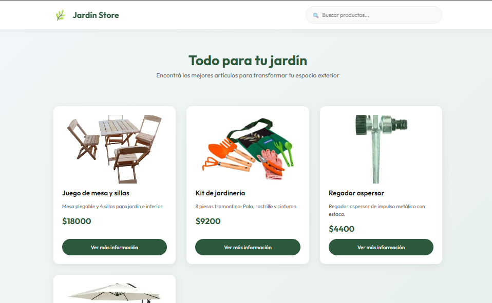
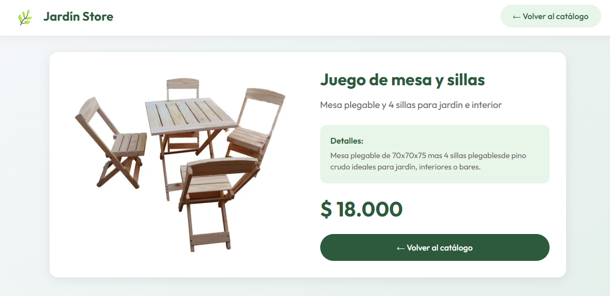

# 🛒 Interactive Product Catalog

A dynamic product catalog built with JavaScript that allows users to browse, filter, and interact with product data in real time.

---

## 🌐 Live Demo

👉 https://marayabrown.github.io/interactive-product-catalog/

---

## 🧠 About the Project

This project was created to practice and demonstrate core frontend development concepts, focusing on dynamic content rendering and user interaction.

The application simulates a real-world product catalog where users can explore items and interact with the interface without page reloads.

---

## ⚙️ Tech Stack

* HTML
* CSS
* JavaScript (Vanilla)

---

## ✨ Key Features

* 📦 Dynamic product rendering
* 🔍 Filtering and interaction based on user input
* ⚡ Real-time UI updates without page reload
* 🧩 DOM manipulation for content management

---

## 🧠 Technical Highlights

* Products are dynamically generated and rendered using JavaScript
* DOM manipulation is used to update the interface based on user actions
* Event listeners handle user interaction and trigger UI changes
* Separation between data structure and UI rendering logic

---

## 🎯 What I Learned

* How to manipulate the DOM efficiently
* How to structure interactive frontend logic
* How to handle user-driven events
* How to build dynamic interfaces without frameworks

---

## 🎥 Preview

---

## 👩‍💻 Author

María Brown

* GitHub: https://github.com/MarayaBrown
* LinkedIn: https://www.linkedin.com/in/brownmaría/

---

## 🚀 Final Note

This project represents a step forward from static layouts to interactive applications, focusing on logic, user interaction, and dynamic rendering.
